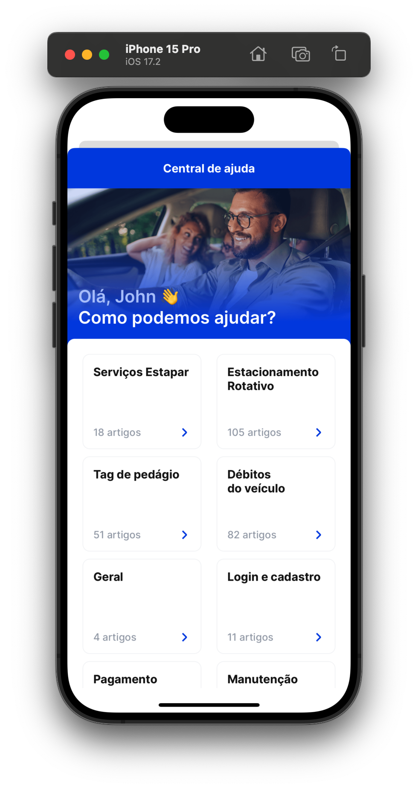
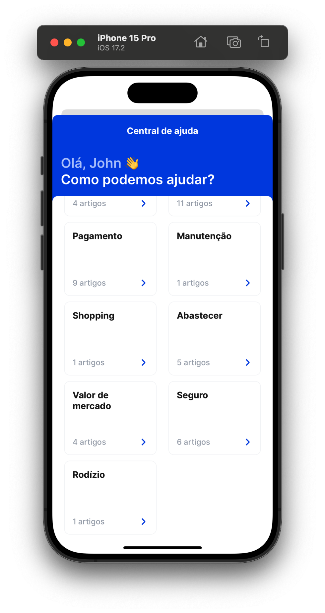
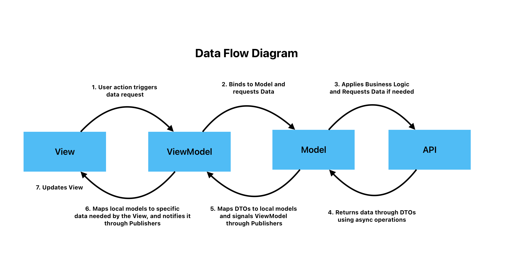
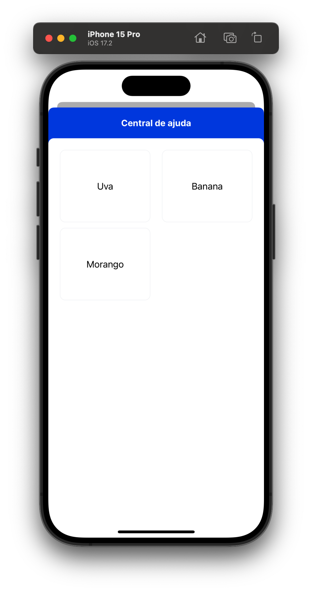

# Estapar/Zul Test App


| Inicio | Home Expandida | Home Colapsada | FAQ | 
| --- | --- | --- | --- |
|  |  |  |  |

## Overview

Este projeto adota diversas tecnologias e padrões para criar uma aplicação iOS eficiente e modular. Primeiramente, utilizei um framework próprio chamado DeclarativeUIKit para facilitar a construção de interfaces de maneira declarativa, inspirado em SwiftUI.

Optei pelo padrão MVVM por ser equilibrado entre complexidade e flexibilidade, proporcionando uma estrutura robusta e testável sem o excesso de boilerplate de outras arquiteturas. Também adicionei um Swift Package chamado DesignSystem, que padroniza fontes e cores conforme os designs definidos no Figma.

Implementei os princípios SOLID no projeto, com ênfase em Single Responsibility, Open-Closed e Dependency Inversion. Isso resultou em um código mais modular e fácil de manter. Por exemplo, as views são altamente reutilizáveis, enquanto a inversão de dependência facilita a substituição de implementações sem afetar o restante do código.

Para gerenciar as dependências, estabeleci um Composition Root, centralizando a criação e injeção de dependências. Isso permite a fácil troca de implementações entre ambientes de desenvolvimento e produção, garantindo flexibilidade e modularidade. Essa abordagem segue os princípios de Clean Architecture, tornando o código mais adaptável e sustentável.

## Tecnologias e Padrões

### UI Declarativo

```swift
final class HelpCenterWelcomeMessage: UIView {
    private var body: UIView {
        VerticalStack {
            UILabel()
                .text("Olá, Eduardo! 👋")
                .font(.h4)
                .textColor(.zulPrimary200)

            UILabel()
                .text("Como podemos ajudar?")
                .font(.h4)
                .textColor(.primaryWhite)
        }
        .padding(.all, 15)
    }

    init() {
        super.init(frame: .zero)
        add(body)
    }

    required init?(coder: NSCoder) {
        fatalError("init(coder:) has not been implemented")
    }
}

```
Para a criação das telas, utilizei um framework próprio chamado [DeclarativeUIKit](https://github.com/Columbina/DeclarativeUIKit) que desenvolvi em 2021 enquanto ainda trabalhava na Alemanha. Este framework virou uma ferramenta essencial para os quase 30 desenvolvedores iOS na época, que buscavam por soluções mais fáceis e rápidas que o UIKit padrão. Ela virou nossa ferramenta de UI padrão e passou a ser o framework de UI mais utilizado entre os times. Essa forma de programar se assemelha muito ao SwiftUI e ao [Builder Pattern](https://refactoring.guru/design-patterns/builder), já que possui um encadeamento de chamadas. Isto é possível pois os métodos retornam o próprio objeto, o que permitem que outras chamadas sejam feitas logo em seguida.


### MVVM
Optei pelo padrão MVVM pois é um dos mais utilizados hoje no mercado, fora que ele tem um bom equilibrio entre complexidade e flexibilidade. Ele não é um padrão tão complicado ou cheio de boilerplates como Clean Architecture e VIPER, porém ainda nos permite uma boa dose de flexibilidade e testabilidade.



 Neste caso, não utilizei Coordinators pois não achei que fosse necessário. Esse padrão seria útil, porém, para desacoplar a navegação dos view controllers, deixando-os menos dependentes de outros View Controllers e simplificando os testes. O framework de UI utilizado neste projeto possui uma abstração de navegação leve, sendo que ela não ocupa muito espaço nas views e é facil de ser utilizada.


### Design System

```swift
UILabel()
    .text("Perguntas frequentes")
    .font(.smallBold) // Design System Extension
    .textColor(.primaryBlack) // Design System Extension
```
Para uma padronização de fontes e cores, criei um Swift Package chamado DesignSystem que concentra todas as cores e fontes encontradas no [Figma](https://www.figma.com/design/CGCpZBrAw3zGkmD0Kadygf/Central-de-ajuda---Prova-Mobile?node-id=179-1287&t=ryRGYIheMt237vDk-0) em questão. Ter um Design System é importante para que mudanças de layout sejam fáceis de serem aplicadas no sistema como um todo. Como um ponto de melhoria, o Figma poderia ter um padrão mais bem definido para as cores e fontes, pois os nomes não seguem um padrão claro. Por exemplo, uma boa idéia seria o time de design aplicar o principio de [Design Tokens](https://m3.material.io/foundations/design-tokens/overview).


```swift
public enum FontScheme {
    case small
    case smallBold
    ...

    public var uiFont: UIFont {
        switch self {

        case .small:
            let size: CGFloat = 14
            let font = UIFont.interFont(ofSize: size, weightValue: 500)
            return font ?? .systemFont(ofSize: size)
        case .smallBold:
            let size: CGFloat = 16
            let font = UIFont.interFont(ofSize: size, weightValue: 700)
            return font ?? .systemFont(ofSize: size)
        ...
        }
    }
}
```

### SOLID
Podemos ver os princípios SOLID sendo aplicados de diversas formas neste projeto. Podemos destacar 3 principais princípios que mais dão as caras: Single Responsibility, Open-Closed e Dependency Inversion. Eles regem a maior das estruturas do codigo.

#### Single Responsibility Principle
Ele está principalmente presente nas Views. As views tendem a ter um unico objetivo e encapsulam todo o comportamento que se espera delas. Por exemplo, a ArrowView tem o único objetivo de mostrar na tela uma seta em uma determinada direção. Outro exemplo seria o NetworkManager, cuja unica função é realizar um request. Ele não realiza mapeamentos nem logica de negócio, por isso utiliza do conceito de [Generics](https://docs.swift.org/swift-book/documentation/the-swift-programming-language/generics/), para que ele não dependa de nenhum tipo de dado especifico.

```swift
final class NetworkManager: NetworkManagerProtocol {
    func request<T: Decodable>(baseURL: URL, endpoint: Endpoint, type: T.Type) async throws -> T {
        ...
    }
}
```

#### Open-Closed Principle
Também muito utilizado nas views, ele permite que nosso codigo seja aberto para modificações e fechado para mudanças. Peguemos o CollectionView, por exemplo. A mensagem de boas vindas ao usuário não está incluido nele, pois isso o tornaria muito dependente de um tipo especifico de apresentação. Por isso, ao invés de ter um próprio header, ele possui um builder para que o cliente passe o header desejado. Isso permite que ele seja reutilizado em diversos contextos, sem ter que ser alterado para tal. 

Além disso, suas células também não são pré-definidas; o cliente pode passar qualquer tipo de representação que desejar para as celulas, o que geralmente não é o caso de UITableViews e UICollectionViews, que possuem celulas muito bem definidas em termos de layout, as tornando muito difíceis de serem reutilizadas.

```swift
CollectionView(["Uva", "Banana", "Morango"]) { item in
    UILabel()
        .text(item)
        .textColor(.black)
        .textAlignment(.center)
        .bordered()
}.asUIView()
```


#### Dependency Inversion
Classes não devem depender de detalhes, mas sim de abstrações. Suponha que, por exemplo, um Model dependa de um Banco de Dados SQL, então `Model -> SQLImplementation`. O banco de dados é um detalhe de implementação nessa relaçnao. Esse cenário não é ideal pois caso exista uma demanda para que o banco de dados seja substituido por outro, o Model será afetado e também sofrerá mudanças. A inversão de dependencia procura reverter a seta de dependencia, fazendo com que o detalhe dependa de uma interface definida para o Model, dessa forma: `Model -> BDInterface <- SQLImplementation`. Dessa forma podemos ter, além do `SQLImplementation`, um `PostgresImplementation`, que também implementa a mesma interface e, portanto, pode ser substituida a qualquer momento no Model.

Podemos ver esse princípio utilizado em diversas classes que possuem injeção de dependencia, como por exemplo na `HelpCenterAPI`. Para nossa API, a utilização de URLSession, Alamofire ou AFNetworking são detalhes de implementaão e por isso estão abstraídos por uma interface `NetworkManagerProtocol`. Uma implementação deste protocolo pode implementar qualquer ferramenta de networking que desejar sem afetar a API.

```swift
struct HelpCenterAPI: HelpCenterAPIProtocol {
    let networkManager: NetworkManagerProtocol

    func categories() async throws -> CategoriesResponseDTO {
        let response = networkManager.request(...)
        ...
    }
    ...
}
```

### Composition Root
Quando você aplica Dependency Inversion de forma consistente na sua aplicação, eventualmente todas as dependencias passarão a ser instanciados em um só local, que é o ponto de partida da sua aplicação. É onde a arvore de dependencias será montada. Esse lugar se chama composition root. A principal vantagem de se ter uma composition root é que você consegue facilmente injetar diferentes instancias que podem mudar completamente o comportamento do seu código. Por exemplo, podemos ter uma composition root para ambiente de desenvolvimento, onde utilizamos um banco de dados local, ou uma composition root para ambiente de produção, onde o banco de dados utilizado está na nuvem. 

Se você criar diferentes pacotes/módulos para cada composition root, você tem o que o Uncle Bob chama de "The Main Component" em Clean Architecture. Basicamente, o Main Component (ou Module) é o módulo que importa todas as dependencias, as instancía e as injeta nas suas respectivas classes, assim como nosso composition root. Podemos dizer que o composition root é a cola da aplicação.

Sendo ele quem instancia e injeta as dependencias, é super fácil mudar os detalhes da aplicação por aqui. Por exemplo, podemos tem uma HelpCenterAPI baseada na web e outra baseada em armazenamento local. Para trocálas, basta instanciar a implementação desejada.

```swift
private func compositionRoot() -> UIViewController { 
    ...
    // Podemos usar o serviço web
    let api = HelpCenterAPI(baseURL: baseURL, networkManager: networkManager)
    // Ou uma API totalmente local
    let api = LocalHelpCenterAPI()
    
    let helpCenterModel = HelpCenterModel(api: api)
    // Isso é possível pois as duas classses conformam com o mesmo protocolo.
    ...
    return homeViewController
}
```